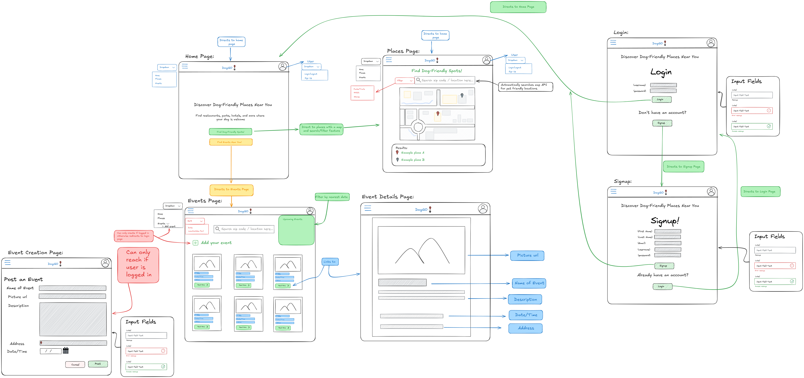
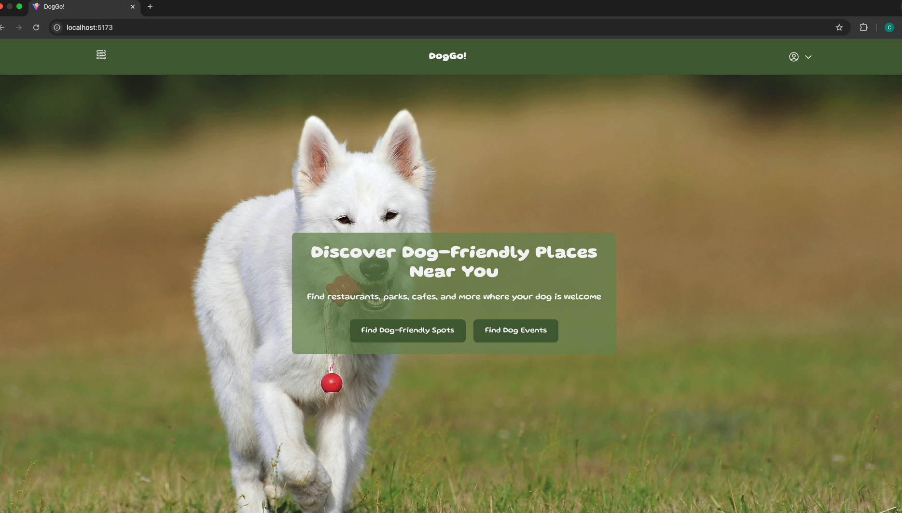
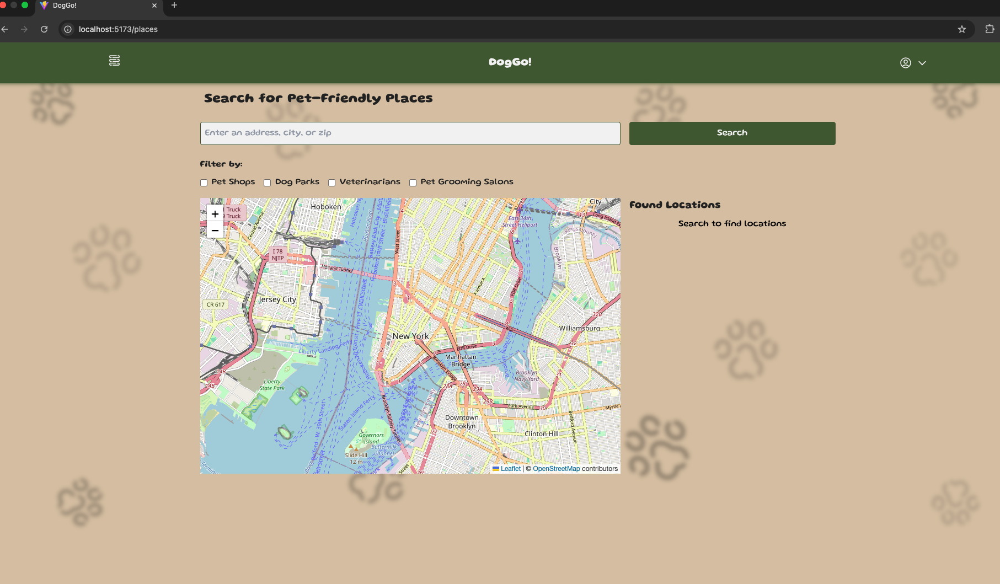
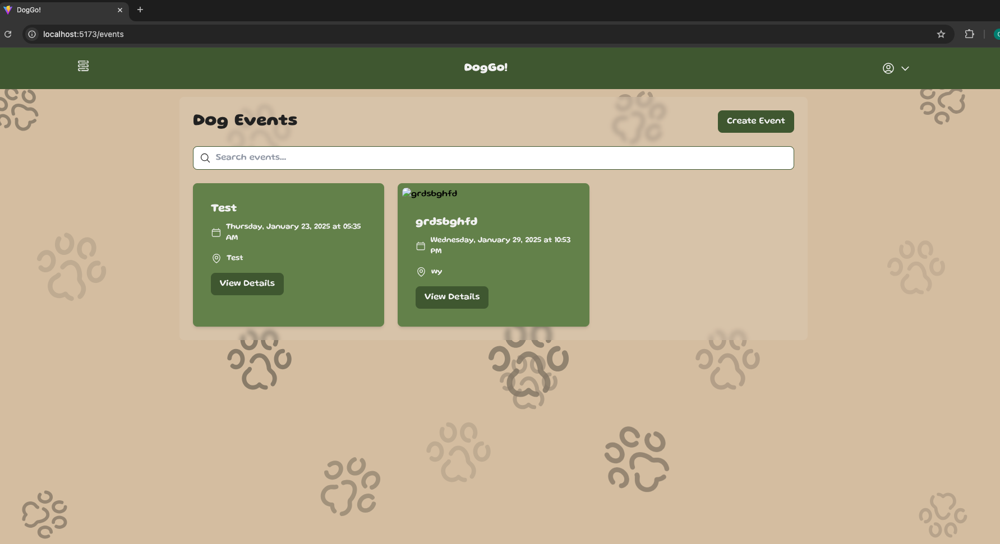

# DOGGO!
DogGo is an application that helps users find pet-friendly locations and events nearby. The app features secure enpoints for users to explore dog-friendly spots, create events, and search for locations using external APIs.

## Application Authors
- April Hemingway
- Zachary Ornelas
- Hayden Schreiber
- Ciera Villalpando

## Design
### Wireframe


### Home Page


### Places Page


### Events Page


## Getting started

- Clone the repository:
- git clone https://gitlab.com/dog-go1/module3-project-gamma.git
- cd your-repo-name
- Create a virtual environment and activate it:
- python -m venv .venv
- source .venv/bin/activate #for linux/macOs
- .\.venv\Scripts\Activate.ps1 #for windows
- Install dependencies:
- pip install -r requirements.txt
- Set up environment variables in a .env file:
- GEOAPIFY_API_KEY=your_geoapify_api_key
- Run Docker Desktop
- Run the application:
- docker compose build
- docker compose up
- http://localhost:5173/ #brings up the application


## API Documentation
### FastAPI Endpoints
The API documentation is automatically generated by FastAPI and can be accessed at:
- Swagger UI (```http://localhost:/8000/doc```): interactive documentation where you can try out API calls directly
- Redoc(```http://localhost:/8000/doc```):
Clean, searchable documentation.

The API includes endpoints for:
- User authentication (signup, signin, signout)
- Event Management
- Location search with filtering
- Geocoding services

### Geoapify Integration
The application uses two main Geoapify services:

#### Places API
Used for finding dog-friendly locations
```
// Example request
const searchParams = {
  categories: 'pet.shop,pet.dog_park,pet.veterinary,pet.service',
  filter: `circle:${longitude},${latitude},5000`,
  limit: 20,
  apiKey: process.env.GEOAPIFY_API_KEY
};

// Base URL
const url = 'https://api.geoapify.com/v2/places';
```

Categories available:
- ```pet.shop``` - Pet shops and supples
- ```pet.dog_park``` - Dog parks and recreation areas
- ```pet.veterinary``` - Veterinary clinics
- ```pet.service``` - Pet grooming and services

#### Geocoding API
Used for converting addresses to coordinates:
```
// Example request
const geocodeParams = {
  text: address,
  apiKey: process.env.GEOAPIFY_API_KEY
};

// Base URL
const url = 'https://api.geoapify.com/v1/geocode/search';

```
For detailed documentation, visit :
- https://apidocs.geoapify.com/docs/places/#about

Note: You'll need to obtain a Geoapify API key from https://www.geoapify.com


#### Your GitLab pages URL

You can't find this in GitLab until after you've done a deploy
but you can figure it out yourself from your GitLab project URL.

If this is your project URL

https://gitlab.com/GROUP_NAME/PROJECT_NAME

then your GitLab pages URL will be

https://GROUP_NAME.gitlab.io/PROJECT_NAME
